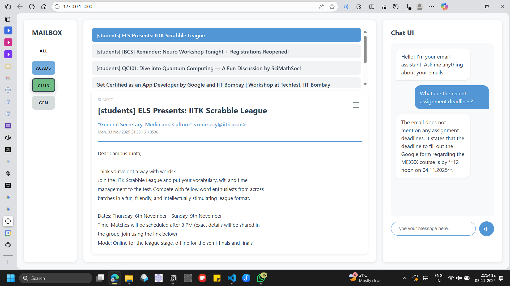

# DELIVERABLES

## Submission Information

**Name:**                         Abhay Kumar (230032)

**University:**                 Indian Institute of Technology Kanpur (IIT Kanpur)

**Department:**             Mechanical Engineering

**Project Title:**             IITK Webmail Email Management & Calendar Assistant AI Agent

**Contact:**                    [abhaykumar23@iitk.ac.in](mailto:abhaykumar23@iitk.ac.in) | 8381824006

# AI Agent Prototype - Deliverables Document

## Project Overview

**Project Name:** IITK Webmail Email Management & Calendar Assistant AI Agent

**Task:** Build an AI Agent that automates the manual task of managing IITK webmail emails and integrating them with calendar scheduling.

**Status:** Completed with source code, system design, and implementation logs

---

## Deliverables List

### 1. Source Code of the Prototype

**Location:** GitHub Repository (to be provided)

**Files Included:**

- `flask_backend_code.py` - Main Flask backend application with:
    - Email fetching and classification using IMAP
    - AI agent implementation with LangGraph
    - Google Calendar integration (add events, check clashes) (Under tool section)
    - RAG (Retrieval-Augmented Generation) system using FAISS
    - RESTful API endpoints for frontend communication
- `index.html` - Frontend UI featuring:
    - Chat interface for user interactions
    - Email display and filtering
    - Calendar event management
    - Real-time query execution against email data
- `requirements.txt`

---

### 2. System Design Document

### 2.1 Architecture Overview

The system follows a **three-tier architecture**:

1. **Frontend Layer (UI)**
    - HTML/CSS/JavaScript chat interface
    - Real-time communication with backend
    - Email classification display
    - Calendar event management dashboard
2. **Backend Layer (Flask Application)**
    - REST API endpoints for email operations
    - Authentication and credential management
    - Email classification logic
    - Calendar synchronization
3. **AI Agent Layer (LangGraph)**
    - Multi-tool agent with reasoning capabilities
    - Tool nodes for email RAG, calendar clash detection, and event creation
    - State management and conditional routing

### 2.2 Component Breakdown

**Core Components:**

1. **Email Fetcher Module**
    - Connects to IITK webmail via IMAP
    - Fetches emails from inbox
    - Deduplicates emails using SHA256 hashing
    - Persists email data in `storage.txt`
2. **Email Classifier Module**
    - Uses Google Gemini 2.5 Flash LLM
    - Classifies emails into categories:
        - Academic (course-related, assignments, grades)
        - Club (activities, events, meetings)
        - General (admin, hostel, placements)
    - Provides structured JSON output
3. **Vector Database & RAG System**
    - **FAISS Index:** Fast similarity search for emails
    - **Embeddings:** Google Generative AI embeddings (3072 dimensions)
    - **Retrieval:** Top-k email retrieval based on semantic similarity
    - **RAG Chain:** LLM-powered answer generation from retrieved emails
4. **Calendar Integration**
    - Google Calendar API integration
    - Event creation with conflict detection
    - Timezone handling (IST as default)
    - Attendee management
5. **AI Agent (LangGraph)**
    - **State:** Maintains conversation history and tool calls
    - **Nodes:**
        - `agent` node: Calls LLM with tool bindings
        - `call_tool` node: Executes selected tools
    - **Tools:**
        - `email_rag_tool`: Search and answer questions about emails
        - `check_clash_tool`: Detect calendar conflicts
        - `add_event_tool`: Create calendar events
    - **Routing:** Conditional routing based on tool call requirements

### 2.3 Data Design

**Email Storage Schema (storage.txt):**

```json
{  "emails": [    {      "id": "email_id",      "subject": "Email subject",      "from": "sender@example.com",      "date": "ISO 8601 timestamp",      "body": "Full email body text",      "hash": "SHA256 hash for deduplication",      "classification": {        "category": "academic|club|general"      }    }  ],  "hashes": ["hash1", "hash2", ...]}
```

**FAISS Index Storage:**
- Serialized FAISS index file (`faiss_index`)
- Metadata pickle file (`email_metadata.pkl`)
- Email IDs mapped to their embeddings

**Credentials Storage:**
- IMAP credentials stored in memory during session
- Google Calendar OAuth tokens persisted in `token.pickle`

### 2.4 Technology Stack & Justification

| Component | Technology | Justification |
| --- | --- | --- |
| **Backend Framework** | Flask | Lightweight, perfect for REST API, easy integration with Python AI libraries |
| **LLM** | Google Gemini 2.5 Flash | Fast, cost-effective, excellent for real-time agent applications |
| **Embeddings** | Google Generative AI (3072 dims) | State-of-the-art embeddings, compatible with Gemini, no additional costs |
| **Vector DB** | FAISS (Meta) | Industry-standard, fast similarity search, in-memory storage suitable for prototype |
| **Email Protocol** | IMAP | Standard protocol for IITK webmail access, secure SSL connection |
| **Calendar API** | Google Calendar | Seamless integration, widely used, reliable |
| **Agent Framework** | LangGraph | Modern agentic AI framework, excellent state management, tool execution |
| **Frontend** | HTML/CSS/JavaScript | Simple, responsive, no build tools needed |
| **Async/Concurrency** | Threading | Background email fetching, non-blocking operations |

### 2.5 API Endpoints

| Endpoint | Method | Description |
| --- | --- | --- |
| `/` | GET | Serve frontend UI |
| `/login` | POST | Store email credentials |
| `/fetch_emails` | GET | Fetch and classify emails from IMAP |
| `/get_emails` | GET | Retrieve stored emails from local storage |
| `/run_query` | GET | Execute agent query with tool execution |

### 2.6 Data Flow Diagram

=================================================================

```
User Input (Frontend)
    ↓
Query Endpoint (/run_query)
    ↓
LLM with Tool Binding (Gemini 2.5 Flash)
    ├→ Tool Call: email_rag_tool
    │    ├→ FAISS Index Search
    │    ├→ Embedding Generation
    │    └→ RAG Answer Generation
    ├→ Tool Call: check_clash_tool
    │    ├→ Google Calendar API
    │    └→ Conflict Detection
    └→ Tool Call: add_event_tool
         ├→ Create Calendar Event
         └→ Return Event Details
    ↓
Response to User
    ↓
Frontend Display
```

---

### 3. Interaction Logs

### 3.1 AI Model Used

- **Model:** Google Gemini 2.5 Flash
- **Embeddings Model:** Google Generative AI Embedding (gemini-embedding-001)
- **Temperature:** 0 (deterministic responses / Least possible randomness)
- **Context Window:** Adequate for email content analysis

### 3.2 Tool Definitions

**Tool 1: email_rag_tool**
- **Purpose:** Answer questions about email content using RAG
- **Input:** Natural language question
- **Process:**
1. Generate embedding for question
2. Search FAISS index for top-k relevant emails
3. Format retrieved emails as context
4. Pass to LLM with RAG prompt
5. Return natural language answer
- **Output:** Answer text derived from email content

**Tool 2: check_clash_tool**
- **Purpose:** Detect calendar scheduling conflicts
- **Input:** Start time, end time, timezone, optional event ID to exclude
- **Process:**
1. Parse ISO format timestamps
2. Convert to UTC for API query
3. Query Google Calendar API
4. Check for overlapping events
5. Return clash details
- **Output:** JSON with clash status and conflicting events

**Tool 3: add_event_tool**
- **Purpose:** Create events on Google Calendar
- **Input:** Event details (summary, time, location, attendees, description)
- **Process:**
1. Check for scheduling conflicts
2. If no conflicts, create event
3. Add event to Google Calendar via API
4. Return event details
- **Output:** JSON with event confirmation and link

### 3.3 Sample Interaction Flows

**Flow 1: Email Search Query**

```
User: "What are the recent assignment deadlines?"
→ Gemini decides to use email_rag_tool
→ Tool searches FAISS for academic emails with keywords like "assignment", "deadline"
→ Retrieved emails are formatted as context
→ Gemini generates answer based on retrieved content
→ Response: "Based on your emails, the following assignments are due..."
```



**Flow 2: Calendar Event Creation**

```
User: "Schedule a meeting with Prof. X on 2025-11-15 at 10:00 AM"
→ Gemini decides to use check_clash_tool then add_event_tool
→ check_clash_tool returns no conflicts
→ add_event_tool creates event with specified time
→ Response: "Meeting scheduled successfully for 2025-11-15 at 10:00 AM"
```


### 3.4 System Prompts Used

**Main Agent System Prompt:**

```
You are an AI assistant that helps users manage their emails and calendar.

For ANY questions about emails, email content, or searching through emails,
you MUST use the email_rag_tool.

Only use the calendar tools (check_clash_tool, add_event_tool) for
calendar-related operations.

Never try to answer email-related questions directly without using
the email_rag_tool.
```

**Email Classifier Prompt:**

```
You are an email classifier for IITK students. Classify the following
email into ONE of these categories:

1. academic - Course-related emails, assignments, quizzes, exams, grades
2. club - Club activities, events, meetings, announcements
3. general - Administrative, hostel, placements, other announcements

Return the JSON object ONLY:
{"category": "academic|club|general"}
```

**RAG Prompt Template:**

```
You are an assistant for answering questions about the user's emails.
Use the provided context to answer the question. If you don't know
the answer, say so.

Context:
{context}

Question:
{question}
```

---

### 4. Feature And Running the Application

### 4.1 Key Features Implemented

1. **Email Management**
    - IMAP connection to IITK webmail
    - Email classification into 3 categories
    - Semantic search using FAISS
    - Email deduplication
2. **Calendar Integration**
    - Google Calendar OAuth authentication
    - Create events with attendees
    - Detect scheduling conflicts
    - Support for multiple timezones (IST as default)
3. **AI Agent Capabilities**
    - Multi-tool reasoning and execution
    - Conversational interface
    - Context-aware responses
    - Persistent email storage
4. **UI/UX Features**
    - Clean chat interface for queries
    - Email list with classification badges
    - Real-time response display
    - Responsive design

### 4.2 How to Run the Application

**Prerequisites:**
- Python 3.10+
- Google Cloud API credentials
- IITK webmail credentials

**Setup Instructions:**

```bash
# 1. Clone the repositorygit clone [repository-url]cd [project-directory]
# 2. Install dependenciespip install -r requirements.txt
# 3. Set up Google Cloud credentials# Place credentials.json in project root
# 4. Configure IITK credentials# Update EMAIL_CREDENTIALS in flask_backend_code.py
# 5. Run the Flask apppython flask_backend_code.py
# 6. Open browser to http://localhost:5000
```

---

## Evaluation Criteria Alignment

### System Design

- **Architecture:** Three-tier (Frontend, Backend, AI Agent)
- **Design Decisions Documented:** Technology choices justified with rationale
- **Data Persistence:** FAISS index, email storage, Google OAuth tokens
- **Scalability Considered:** Modular components, stateless API design

### Coding

- **Code Quality:** Well-structured, documented with comments
- **Error Handling:** Try-catch blocks, graceful error responses
- **Best Practices:** Tool-based agent pattern, separation of concerns
- **Performance:** FAISS for O(log n) similarity search, threading for background tasks

### Originality & Social Impact

- **Novel Concept:** Combining email classification + RAG + calendar management in one agent
- **Social Impact:** Will help IIT Kanpur students manage academic workload and schedules
- **Real-world Use:** Solves actual pain points of organizing university emails

### UI/UX Design

- **User Interface:** Clean, intuitive chat interface
- **User Experience:** Real-time responses, clear classification badges
- **Accessibility:** Simple HTML/CSS, responsive design

---


##
